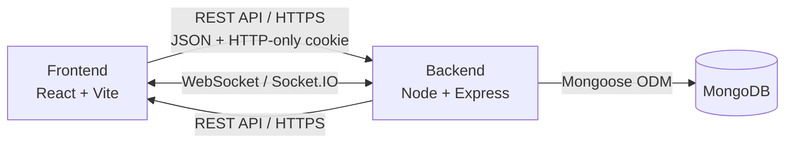

<div align="center">

<h1>pullRequest</h1>

<p><strong>A developer networking platform: discover other developers, send a connection request, and chat in real time once it's merged.</strong></p>

[](https://pullrequest-roan.vercel.app)
[](LICENSE)
[](#contributing)

<a href="https://pullrequest-roan.vercel.app"><strong>Visit the app →</strong></a>

</div>

---

## What this is

A full-stack developer networking app built around a simple metaphor: connecting with someone is like opening a pull request, and once they accept, it's merged. Under that idea sits a real product — a browsable feed, a request/accept flow, a connections list, and real-time chat — built on a React frontend and a Node/Express API backed by MongoDB.

## Highlights

- **A request/merge connection model**, not a generic "match." Sending interest opens a request; the other person accepts or rejects it; an accepted request becomes a connection you can message.
- **Real-time chat over Socket.IO**, not polling — messages arrive instantly in an open chat room between two connected users.
- **Cookie-based session auth** with an HTTP-only JWT cookie, used to authenticate both REST calls and the socket handshake, so there's one source of truth for "who's logged in."
- **A single connections store in Redux**, populated once on login and read by every page (Feed, Connections, Requests, Chat) — no page fetches its own duplicate copy of the same data.
- **Consistent UI language throughout**, styled with Tailwind and DaisyUI so the whole app follows one theme rather than a mix of ad hoc styles.

## Screenshots

<table>
<tr>
<td width="50%"><p align="center"><em>Home</em></p></td>
<td width="50%"><p align="center"><em>Feed</em></p></td>
</tr>
<tr>
<td width="50%"><p align="center"><em>Connections</em></p></td>
<td width="50%"><p align="center"><em>Chat</em></p></td>
</tr>
</table>

## Why this stack

| Layer | Choice | Why |
| --- | --- | --- |
| Frontend | **React 19 + Vite** | Fast dev server and build times, plain component model without extra framework conventions to work around. |
| Styling | **Tailwind CSS + DaisyUI** | Utility classes for layout, DaisyUI component primitives (cards, dropdowns, modals) so the UI stays consistent without hand-rolling every component. |
| State | **Redux / React Redux** | One shared store for user and connections state, read by multiple unrelated pages without prop-drilling or duplicate fetches. |
| Routing | **React Router** | Nested routes via a shared layout (`Body`) so NavBar and Footer wrap every page without repeating them. |
| Real-time | **Socket.IO** | Bidirectional events for chat delivery, with reconnection handling that raw WebSockets don't give you for free. |
| Backend | **Node.js + Express** | Minimal, well-understood REST layer for auth, profile, feed, and request/connection endpoints. |
| Database | **MongoDB + Mongoose** | Flexible schema for evolving profile fields, straightforward relationships for requests and connections via referenced documents. |
| Auth | **JWT in an HTTP-only cookie** | Session token isn't accessible to client-side JS, reducing XSS exposure, while still working for both REST and the socket handshake. |

## Architecture



<details>
<summary>Plain-text version</summary>

```
Frontend (React + Vite)  <-- REST API (HTTPS) -->  Backend (Node + Express)
Frontend (React + Vite)  <-- WebSocket (Socket.IO) -->  Backend (Node + Express)
Backend (Node + Express) --> MongoDB (Mongoose ODM)
```

</details>

## Project structure

```
pullRequest/
├── frontend/
│   └── src/
│       ├── components/
│       │   ├── Body.jsx           # Layout wrapper (NavBar + Outlet + Footer)
│       │   ├── NavBar.jsx
│       │   ├── Footer.jsx
│       │   ├── Home.jsx
│       │   ├── Login.jsx
│       │   ├── Feed.jsx
│       │   ├── Connections.jsx
│       │   ├── Request.jsx
│       │   ├── Chat.jsx
│       │   └── ProfileEdit.jsx
│       ├── utils/
│       │   ├── appStore.js         # Redux store config
│       │   ├── userSlice.js
│       │   ├── connectionSlice.js
│       │   └── constant.js         # BASE_URL and constants
│       └── App.jsx                 # Route definitions
│
└── backend/
    └── src/
        ├── models/                 # Mongoose schemas (User, ConnectionRequest, Chat, Message)
        ├── routes/                 # Express route handlers
        ├── middlewares/            # Auth middleware, error handling
        ├── utils/                  # Socket.IO setup, validation helpers
        └── app.js                  # Express app entry point
```

## API reference

| Method | Endpoint | Description |
| --- | --- | --- |
| POST | `/signup` | Register a new user |
| POST | `/login` | Log in, sets auth cookie |
| POST | `/logout` | Clear auth cookie |
| GET | `/profile/view` | Get the logged-in user's profile |
| PATCH | `/profile/edit` | Update profile details |
| GET | `/feed` | Get developer profiles to browse |
| POST | `/request/send/:status/:userId` | Send interested/ignored request |
| POST | `/request/review/:status/:requestId` | Accept/reject an incoming request |
| GET | `/user/requests/received` | List incoming connection requests |
| GET | `/user/connections` | List accepted connections |

**Socket.IO events**

| Event | Direction | Description |
| --- | --- | --- |
| `joinChat` | Client → Server | Join a chat room with a connection |
| `sendMessage` | Client → Server | Send a new message |
| `messageReceived` | Server → Client | Broadcast a new message to the room |

## Running locally

```bash
git clone https://github.com/SanketHajare44/pullRequest.git
cd pullRequest

cd backend && npm install
cd ../frontend && npm install
```

Set environment variables:

**`backend/.env`**
```env
PORT=3000
MONGO_URI=your_mongodb_connection_string
JWT_SECRET=your_jwt_secret
```

**`frontend/src/utils/constant.js`**
```js
export const BASE_URL = "http://localhost:3000";
```

Run both servers:

```bash
# Terminal 1
cd backend && npm run dev

# Terminal 2
cd frontend && npm run dev
```

The app runs at `http://localhost:5173`.

| Variable | Location | Description |
| --- | --- | --- |
| `PORT` | backend | Port the Express server runs on |
| `MONGO_URI` | backend | MongoDB connection string |
| `JWT_SECRET` | backend | Secret used to sign auth tokens |
| `BASE_URL` | frontend | URL the frontend calls for the API |

## Roadmap

- Filter feed by tech stack / experience level
- Push notifications for new requests and messages
- Read receipts and typing indicators in chat
- Mobile-responsive polish

## Contributing

1. Fork the repository and create a branch: `git checkout -b feature/your-feature-name`
2. Make your changes, following the existing code style (functional components, DaisyUI/Tailwind classes, existing folder structure)
3. Commit with a clear message and open a pull request against `main`, describing what the change does and why

Keep pull requests focused on one feature or fix, test both frontend and backend locally before submitting, and never commit `.env` files or secrets. Found a bug or have an idea? Open an [issue](https://github.com/SanketHajare44/pullRequest/issues).

## Terms & Conditions

By creating an account or using pullRequest, you agree to provide accurate profile information and keep your credentials confidential. The platform is for professional networking between developers — harassment, spam, impersonation, or abusive behavior toward other users isn't permitted and may result in suspension. Content you post remains yours; you grant the platform the right to store and display it to provide the service. This is a personal/portfolio project under active development, provided "as is," and not intended for production use with sensitive data.

## License

MIT — see [LICENSE](LICENSE).

## Author

<table>
  <tr>
    <td>
      <strong>Sanket Hajare</strong>
    </td>
    <td>
      <a href="https://pullrequest-roan.vercel.app">Live Demo</a> &middot;
      <a href="https://github.com/SanketHajare44">GitHub</a>
    </td>
  </tr>
</table>