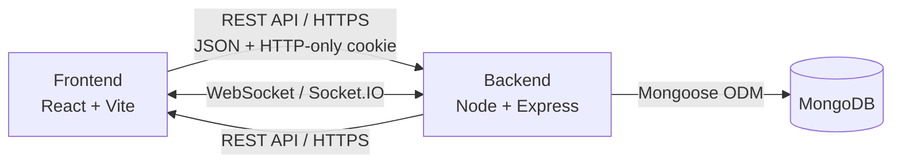

<div align="center">

# PullRequest

### Developer Networking & Real-Time Communication Platform

<p>
  A full-stack platform where developers can discover other developers,
  build connections, manage requests, and communicate through real-time chat.
</p>

<p>
<a href="https://pullrequest-roan.vercel.app">
<strong>Live Demo →</strong>
</a>
&nbsp;&nbsp;·&nbsp;&nbsp;
<a href="https://github.com/SanketHajare44/pullRequest">
<strong>Repository</strong>
</a>
</p>

<br />


</div>

---

## Overview

PullRequest is a full-stack developer networking platform built to help developers discover people with similar interests, create professional connections, and communicate through real-time messaging.

The application provides a complete user flow:

```text
Create Account
      │
      ▼
    Login
      │
      ▼
Developer Feed
      │
      ├───────────────┐
      │               │
      ▼               ▼
 Interested        Ignored
      │
      ▼
Connection Request
      │
      ├───────────────┐
      │               │
      ▼               ▼
   Accepted        Rejected
      │
      ▼
Connections
      │
      ▼
    Chat
      │
      ▼
Real-Time Messaging
```

---

## Screenshots

<table>
<tr>
<td width="50%"><p align="center"><em>Home</em></p></td>
<td width="50%"><p align="center"><em>Feed</em></p></td>
</tr>
<tr>
<td width="50%"><p align="center"><em>Connections</em></p></td>
<td width="50%"><p align="center"><em>Chat</em></p></td>
</tr>
</table>

> Add your actual screenshots to a `screenshots/` folder in the repo root, named to match the paths above (or update the paths to match your own file names).

---

## Features

- **Authentication** — Secure signup/login with cookie-based sessions
- **Developer Feed** — Browse other developers' profiles one at a time
- **Connection Requests** — Send, accept, or reject requests to connect
- **Connections** — View and manage your accepted connections
- **Real-Time Chat** — Message connections instantly via Socket.IO
- **Profile Management** — Edit profile details and photo

---

## Tech Stack

<table>
<tr>
<td valign="top" width="50%">

**Frontend**
- React 19
- Vite 7
- Tailwind CSS + DaisyUI
- Redux / React Redux
- React Router
- Axios
- Socket.IO Client

</td>
<td valign="top" width="50%">

**Backend**
- Node.js 24
- Express 5
- MongoDB + Mongoose
- Socket.IO
- JSON Web Tokens (JWT)
- bcrypt

</td>
</tr>
</table>

---

## Architecture



<details>
<summary>Plain-text version</summary>

```
Frontend (React + Vite)  <-- REST API (HTTPS) -->  Backend (Node + Express)
Frontend (React + Vite)  <-- WebSocket (Socket.IO) -->  Backend (Node + Express)
Backend (Node + Express) --> MongoDB (Mongoose ODM)
```

</details>

- **REST API** handles auth, profile, feed, requests, and connections
- **Socket.IO** handles real-time chat delivery between connected users
- **JWT stored in an HTTP-only cookie** authenticates both REST requests and the socket handshake

---

## Project Structure

```
pullRequest/
├── frontend/
│   └── src/
│       ├── components/
│       │   ├── Body.jsx           # Layout wrapper (NavBar + Outlet + Footer)
│       │   ├── NavBar.jsx
│       │   ├── Footer.jsx
│       │   ├── Home.jsx
│       │   ├── Login.jsx
│       │   ├── Feed.jsx
│       │   ├── Connections.jsx
│       │   ├── Request.jsx
│       │   ├── Chat.jsx
│       │   └── ProfileEdit.jsx
│       ├── utils/
│       │   ├── appStore.js         # Redux store config
│       │   ├── userSlice.js
│       │   ├── connectionSlice.js
│       │   └── constant.js         # BASE_URL and constants
│       └── App.jsx                 # Route definitions
│
└── backend/
    └── src/
        ├── models/                 # Mongoose schemas (User, ConnectionRequest, Chat, Message)
        ├── routes/                 # Express route handlers
        ├── middlewares/            # Auth middleware, error handling
        ├── utils/                  # Socket.IO setup, validation helpers
        └── app.js                  # Express app entry point
```

---

## API Reference

| Method | Endpoint                          | Description                          |
|--------|------------------------------------|----------------------------------------|
| POST   | `/signup`                          | Register a new user                    |
| POST   | `/login`                           | Log in, sets auth cookie               |
| POST   | `/logout`                          | Clear auth cookie                      |
| GET    | `/profile/view`                    | Get the logged-in user's profile       |
| PATCH  | `/profile/edit`                    | Update profile details                 |
| GET    | `/feed`                            | Get developer profiles to browse       |
| POST   | `/request/send/:status/:userId`    | Send interested/ignored request        |
| POST   | `/request/review/:status/:requestId` | Accept/reject an incoming request     |
| GET    | `/user/requests/received`          | List incoming connection requests      |
| GET    | `/user/connections`                | List accepted connections              |

> Adjust routes above to exactly match your backend if they differ.

### Socket.IO Events

| Event            | Direction        | Description                          |
|-------------------|-------------------|----------------------------------------|
| `joinChat`         | Client → Server    | Join a chat room with a connection     |
| `sendMessage`       | Client → Server    | Send a new message                     |
| `messageReceived`    | Server → Client     | Broadcast a new message to the room    |

---

## Getting Started

### Prerequisites

- Node.js 18+
- MongoDB (local or Atlas connection string)
- npm or yarn

### 1. Clone the repository

```bash
git clone https://github.com/SanketHajare44/pullRequest.git
cd pullRequest
```

### 2. Install dependencies

```bash
cd backend && npm install
cd ../frontend && npm install
```

### 3. Configure environment variables

**`backend/.env`**
```env
PORT=3000
MONGO_URI=your_mongodb_connection_string
JWT_SECRET=your_jwt_secret
```

**`frontend/src/utils/constant.js`**
```js
export const BASE_URL = "http://localhost:3000";
```

### 4. Run the app

```bash
# Terminal 1 — backend
cd backend
npm run dev

# Terminal 2 — frontend
cd frontend
npm run dev
```

The app will be running at:

```
http://localhost:5173
```

---

## Roadmap

- [ ] Filter feed by tech stack / experience level
- [ ] Push notifications for new requests and messages
- [ ] Read receipts and typing indicators in chat
- [ ] Mobile-responsive polish

---

## Author

**Sanket Hajare**
[GitHub](https://github.com/SanketHajare44) · [Live Demo](https://pullrequest-roan.vercel.app)

---

## Contributing

Contributions are welcome. To contribute:

1. **Fork** the repository
2. **Create a branch** for your feature or fix
   ```bash
   git checkout -b feature/your-feature-name
   ```
3. **Make your changes**, following the existing code style (functional components, DaisyUI/Tailwind classes, existing folder structure)
4. **Commit** with a clear message
   ```bash
   git commit -m "Add: short description of change"
   ```
5. **Push** your branch and **open a Pull Request** against `main`, describing what the change does and why

### Guidelines

- Keep pull requests focused — one feature or fix per PR
- Test your changes locally (both frontend and backend) before submitting
- Don't commit `.env` files or secrets
- Be respectful and constructive in code review discussions

### Reporting Issues

Found a bug or have a feature idea? Open an [issue](https://github.com/SanketHajare44/pullRequest/issues) with a clear title and, for bugs, steps to reproduce.

---

## Terms & Conditions

By creating an account or using PullRequest, you agree to the following:

- You must provide accurate profile information and are responsible for maintaining the confidentiality of your account credentials.
- The platform is intended for professional networking between developers. Harassment, spam, impersonation, or abusive behavior toward other users is not permitted and may result in account suspension.
- Content you post (profile details, messages) remains yours, but you grant the platform the right to store and display it as needed to provide the service.
- The platform is provided "as is" during active development — features, availability, and data may change without notice.
- This is currently a personal/portfolio project and is not intended for production use with sensitive data.

> Replace this section with your own full Terms of Service if the project moves toward public/production use — a generic template like this is a starting point, not a legal document.

---

## License

This project is licensed under the **MIT License** — see the [LICENSE](./LICENSE) file for details.

In short: you're free to use, copy, modify, and distribute this code (including for commercial purposes), as long as the original copyright notice is included. It's provided without warranty.